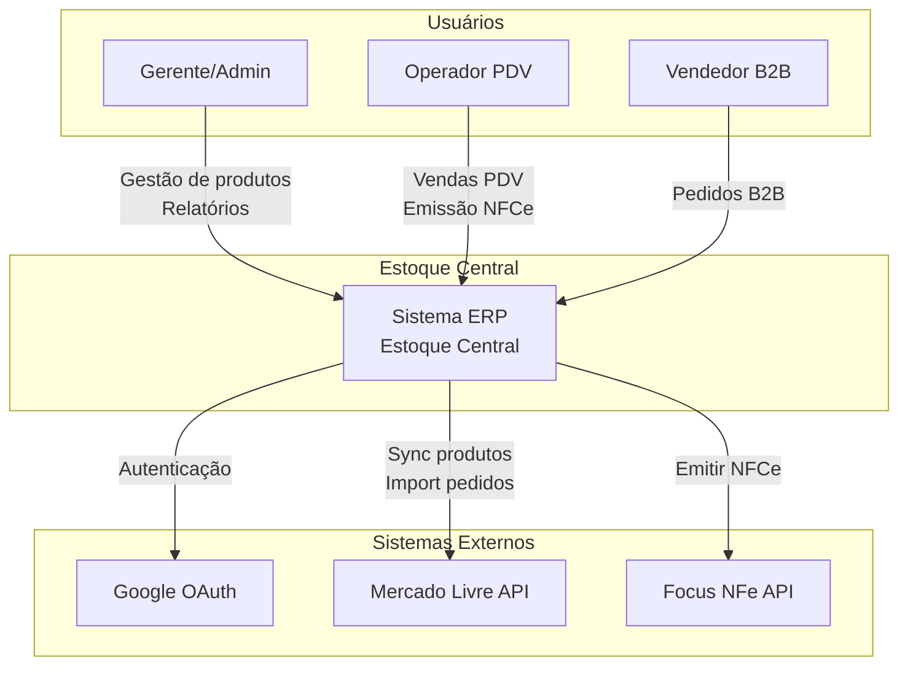
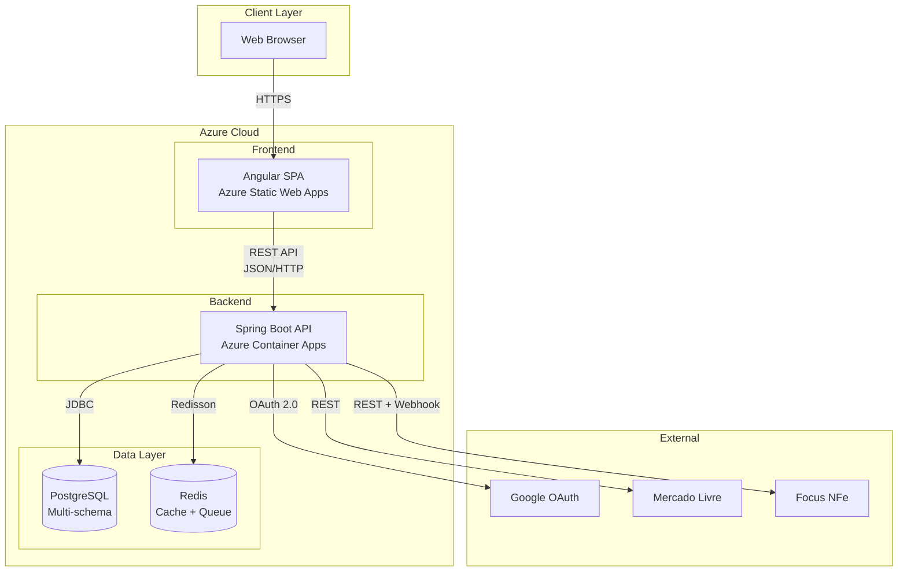
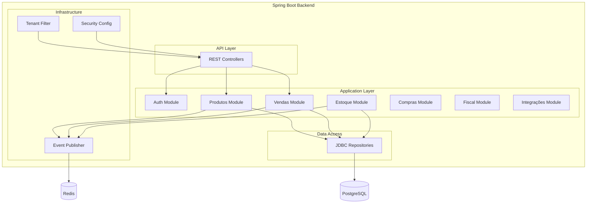
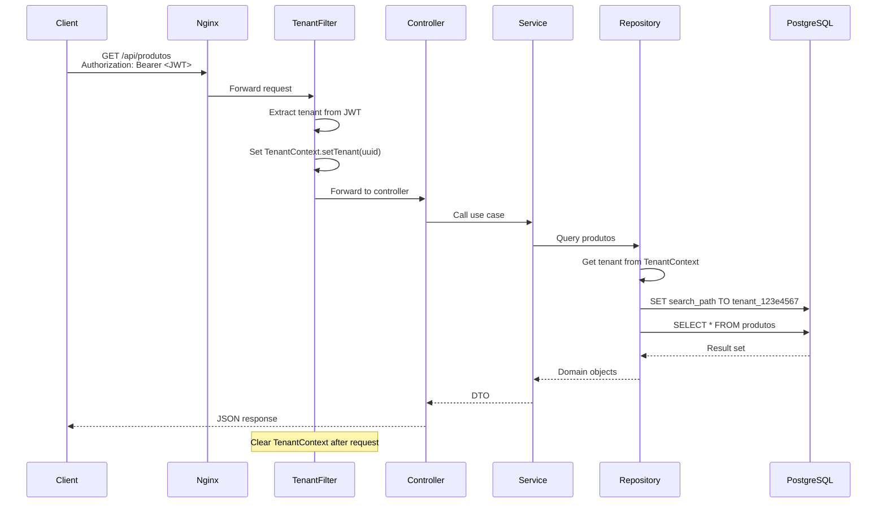

# 2. High Level Architecture

## 2.1. Technical Summary

O **Estoque Central** é um sistema ERP omnichannel multi-tenant implementado como:

- **Tipo**: Monorepo híbrido (backend Java + frontend Angular)
- **Padrão Arquitetural**: Hexagonal Architecture (Ports & Adapters) com Spring Modulith
- **Multi-tenancy**: Schema-per-tenant PostgreSQL com routing dinâmico
- **Comunicação**: REST API + Event-driven (Spring ApplicationEvents)
- **Deploy**: Azure Container Apps (backend) + Azure Static Web Apps (frontend)

### **Decisões Arquiteturais Chave**

| Decisão | Escolha | Alternativa Rejeitada | Razão |
|---------|---------|----------------------|-------|
| **Estrutura Backend** | Single Maven Module + Spring Modulith | Maven Multi-Module | Simplicidade para MVP, boundaries via packages |
| **Multi-tenancy** | Schema-per-tenant | Row-level (tenant_id) | Melhor isolamento, compliance LGPD, performance |
| **Frontend State** | Angular Signals | NgRx | Zero overhead, simplicidade, suficiente para MVP |
| **ORM** | Spring Data JDBC | Hibernate/JPA | Controle explícito, DDD aggregates, sem lazy loading |
| **API Gateway** | Nginx (futuro) | Azure API Management | Custo inicial zero, suficiente para início |

---

## 2.2. Platform and Deployment Environment

### **Ambiente de Desenvolvimento Local**

```
┌─────────────────────────────────────────────────────────────┐
│                      Developer Machine                       │
│                                                               │
│  ┌──────────────┐  ┌──────────────┐  ┌──────────────┐       │
│  │   Backend    │  │   Frontend   │  │    Docker    │       │
│  │ Spring Boot  │  │   Angular    │  │ Compose      │       │
│  │ :8080        │  │   :4200      │  │              │       │
│  └──────┬───────┘  └──────────────┘  │ - PostgreSQL │       │
│         │                             │ - Redis      │       │
│         └─────────────────────────────┤              │       │
│                                       └──────────────┘       │
└─────────────────────────────────────────────────────────────┘
```

### **Ambiente de Produção (Azure)**

```
┌──────────────────────────────────────────────────────────────────┐
│                          Azure Cloud                              │
│                                                                    │
│  ┌────────────────────────────────────────────────────────────┐  │
│  │                    Azure Front Door                         │  │
│  │              (CDN + WAF + Global Load Balancer)             │  │
│  └──────────────┬─────────────────────────┬───────────────────┘  │
│                 │                         │                       │
│  ┌──────────────▼──────────────┐  ┌──────▼───────────────────┐  │
│  │ Azure Static Web Apps       │  │ Azure Container Apps     │  │
│  │                             │  │                          │  │
│  │  Angular Frontend           │  │  Spring Boot Backend     │  │
│  │  - CDN global               │  │  - Auto-scaling (0-10)   │  │
│  │  - Custom domain            │  │  - Health checks         │  │
│  └─────────────────────────────┘  │  - Revision management   │  │
│                                    └──────┬───────────────────┘  │
│                                           │                       │
│  ┌────────────────────────────────────────┼───────────────────┐  │
│  │                   Data Layer           │                   │  │
│  │                                        │                   │  │
│  │  ┌──────────────────────────┐  ┌──────▼───────────────┐  │  │
│  │  │ Azure Database for       │  │ Azure Cache for      │  │  │
│  │  │ PostgreSQL - Flexible    │  │ Redis                │  │  │
│  │  │                          │  │                      │  │  │
│  │  │ - Multi-schema           │  │ - Retry queue        │  │  │
│  │  │ - Automated backups      │  │ - Session cache      │  │  │
│  │  │ - Point-in-time restore  │  │ - Pub/sub            │  │  │
│  │  └──────────────────────────┘  └──────────────────────┘  │  │
│  └────────────────────────────────────────────────────────────┘  │
│                                                                    │
│  ┌────────────────────────────────────────────────────────────┐  │
│  │                   Monitoring & Logging                      │  │
│  │                                                              │  │
│  │  Azure Application Insights + Log Analytics                 │  │
│  └────────────────────────────────────────────────────────────┘  │
└──────────────────────────────────────────────────────────────────┘
```

### **Ambientes**

| Ambiente | Propósito | URL Base | Database | Auto-scaling |
|----------|-----------|----------|----------|--------------|
| **Local** | Desenvolvimento | localhost:4200 | Docker PostgreSQL | N/A |
| **Dev** | Integração contínua | dev.estoquecentral.app | Azure PostgreSQL (dev tier) | Não |
| **Staging** | Testes de aceitação | staging.estoquecentral.app | Azure PostgreSQL (prod tier) | Sim (1-3) |
| **Prod** | Produção | app.estoquecentral.com | Azure PostgreSQL (prod tier) | Sim (2-10) |

---

## 2.3. Repository Structure

```
estoque-central/                    # Monorepo raiz
│
├── .github/                        # GitHub Actions workflows
│   └── workflows/
│       ├── backend-ci.yml          # CI para backend (test + build)
│       ├── frontend-ci.yml         # CI para frontend (test + build)
│       └── deploy-production.yml   # CD para produção
│
├── backend/                        # Backend Java/Spring Boot
│   ├── src/main/java/com/estoquecentral/
│   │   ├── produtos/               # Spring Modulith module
│   │   ├── estoque/                # Spring Modulith module
│   │   ├── vendas/                 # Spring Modulith module
│   │   ├── compras/                # Spring Modulith module
│   │   ├── fiscal/                 # Spring Modulith module
│   │   ├── integracoes/            # Spring Modulith module
│   │   └── auth/                   # Spring Modulith module
│   ├── src/main/resources/
│   │   └── db/migration/           # Flyway migrations
│   ├── src/test/java/              # Testes unitários e integração
│   └── pom.xml                     # Maven single module
│
├── frontend/                       # Frontend Angular
│   ├── src/app/
│   │   ├── core/                   # Singleton services (auth, http)
│   │   ├── shared/                 # Componentes compartilhados
│   │   ├── features/               # Feature modules
│   │   │   ├── produtos/
│   │   │   ├── vendas/
│   │   │   ├── estoque/
│   │   │   └── pdv/
│   │   └── layout/                 # Layout components
│   ├── angular.json                # Angular config
│   └── package.json                # npm dependencies
│
├── docker/                         # Docker files
│   ├── backend.Dockerfile          # Multi-stage build backend
│   ├── frontend.Dockerfile         # Multi-stage build frontend
│   └── docker-compose.yml          # Local development
│
├── infrastructure/                 # IaC (Infrastructure as Code)
│   └── azure/
│       ├── main.bicep              # Bicep template principal
│       ├── modules/
│       │   ├── container-app.bicep
│       │   ├── database.bicep
│       │   └── redis.bicep
│       └── parameters/
│           ├── dev.json
│           ├── staging.json
│           └── prod.json
│
├── scripts/                        # Automation scripts
│   ├── init-dev-env.sh             # Setup inicial local
│   ├── seed-dev-data.sh            # Popular banco com dados de teste
│   └── deploy.sh                   # Script de deploy
│
├── docs/                           # Documentação
│   ├── prd.md                      # Product Requirements
│   ├── architecture.md             # Este documento
│   └── api/
│       └── openapi.yaml            # OpenAPI spec
│
├── README.md                       # Getting started
├── .gitignore
└── .editorconfig
```

### **Estrutura do Backend (Hexagonal + Spring Modulith)**

```
backend/src/main/java/com/estoquecentral/
│
├── produtos/                       # Bounded Context: Produtos
│   ├── domain/
│   │   ├── model/
│   │   │   ├── Produto.java        # Aggregate root
│   │   │   ├── Categoria.java
│   │   │   └── Variante.java
│   │   ├── port/
│   │   │   ├── in/                 # Inbound ports (use cases)
│   │   │   │   ├── CriarProdutoUseCase.java
│   │   │   │   └── BuscarProdutoUseCase.java
│   │   │   └── out/                # Outbound ports (repositories, APIs)
│   │   │       └── ProdutoRepository.java
│   │   └── event/
│   │       └── ProdutoCriadoEvent.java
│   ├── application/
│   │   └── service/
│   │       └── ProdutoService.java # Implementa use cases
│   └── adapter/
│       ├── in/
│       │   └── web/
│       │       └── ProdutoController.java # REST API
│       └── out/
│           └── persistence/
│               └── ProdutoJdbcRepository.java
│
├── vendas/                         # Bounded Context: Vendas
│   ├── domain/
│   ├── application/
│   └── adapter/
│
├── estoque/                        # Bounded Context: Estoque
│   ├── domain/
│   ├── application/
│   └── adapter/
│
└── shared/                         # Shared kernel
    ├── domain/
    │   └── valueobject/
    │       ├── Money.java
    │       └── TenantId.java
    └── infrastructure/
        ├── tenant/
        │   ├── TenantContext.java
        │   └── TenantFilter.java
        └── config/
            ├── SecurityConfig.java
            └── DatabaseConfig.java
```

### **Estrutura do Frontend (Feature-based)**

```
frontend/src/app/
│
├── core/                           # Singleton services
│   ├── auth/
│   │   ├── auth.service.ts
│   │   ├── auth.guard.ts
│   │   └── auth.interceptor.ts
│   ├── http/
│   │   └── tenant.interceptor.ts
│   └── tenant/
│       └── tenant.service.ts
│
├── shared/                         # Shared components & utilities
│   ├── components/
│   │   ├── data-table/
│   │   ├── loading-spinner/
│   │   └── error-message/
│   ├── models/
│   │   ├── produto.model.ts
│   │   └── venda.model.ts
│   └── pipes/
│       └── money.pipe.ts
│
├── features/                       # Feature modules
│   ├── produtos/
│   │   ├── produto-list/
│   │   │   ├── produto-list.component.ts
│   │   │   ├── produto-list.component.html
│   │   │   └── produto-list.component.spec.ts
│   │   ├── produto-form/
│   │   └── services/
│   │       └── produto.service.ts
│   │
│   ├── pdv/                        # PDV feature
│   │   ├── carrinho/
│   │   ├── pagamento/
│   │   └── stores/
│   │       └── pdv.store.ts        # Signal-based store
│   │
│   └── vendas/
│       ├── venda-list/
│       └── venda-detail/
│
└── layout/
    ├── main-layout/
    │   ├── main-layout.component.ts
    │   ├── header/
    │   └── sidebar/
    └── auth-layout/
```

---

## 2.4. Architecture Diagrams

### **Diagrama de Contexto (C4 - Level 1)**



### **Diagrama de Containers (C4 - Level 2)**



### **Diagrama de Componentes Backend (C4 - Level 3)**



### **Fluxo de Request Multi-tenant**



---

## 2.5. Technology Stack Overview

| Camada | Tecnologia | Versão | Propósito |
|--------|-----------|--------|-----------|
| **Frontend** | Angular | 17+ | SPA com standalone components |
| **Backend** | Spring Boot | 3.3+ | REST API + Business logic |
| **Database** | PostgreSQL | 16+ | Persistent storage (schema-per-tenant) |
| **Cache** | Redis | 7.2+ | Session cache + Retry queue |
| **Auth** | Google OAuth 2.0 + JWT | - | Autenticação e autorização |
| **Deploy** | Azure Container Apps | - | Managed container hosting |
| **CI/CD** | GitHub Actions | - | Automated testing + deployment |
| **Monitoring** | Application Insights | - | Logs, metrics, traces |

_(Ver Seção 3 para tech stack completo)_

---

## 2.6. Key Architectural Patterns

### **1. Hexagonal Architecture (Ports & Adapters)**

- **Domain** no centro, isolado de frameworks
- **Ports** (interfaces) definem contratos
- **Adapters** implementam integração com mundo externo

### **2. Spring Modulith**

- Bounded contexts como packages Java
- Event-driven communication entre módulos
- ArchUnit para verificar boundaries

### **3. Multi-tenancy via Schema-per-tenant**

- Cada tenant tem schema PostgreSQL isolado
- `AbstractRoutingDataSource` roteia queries
- `TenantContext` armazena tenant ID via ThreadLocal

### **4. Event-Driven Architecture**

- Comunicação assíncrona via `ApplicationEventPublisher`
- Eventos persistidos com Spring Modulith Event Log
- Retry automático de eventos falhados

### **5. API-First Design**

- OpenAPI spec como contrato
- Geração automática de TypeScript clients
- Validação de requests via Bean Validation

---

**Próxima seção: Tech Stack (detalhamento completo)**
