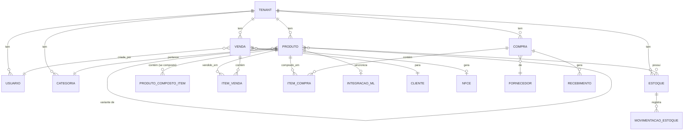

# 4. Data Models

## 4.1. Conceptual Data Model



---

## 4.2. TypeScript Frontend Models

### **4.2.1. Core Domain Models**

```typescript
// src/app/shared/models/tenant.model.ts
export interface Tenant {
  id: string;
  nome: string;
  cnpj?: string;
  email: string;
  ativo: boolean;
  dataCriacao: Date;
}

// src/app/shared/models/usuario.model.ts
export interface Usuario {
  id: string;
  nome: string;
  email: string;
  role: UserRole;
  tenantId: string;
  ativo: boolean;
  ultimoLogin?: Date;
}

export enum UserRole {
  ADMIN = 'ADMIN',
  GERENTE = 'GERENTE',
  OPERADOR_PDV = 'OPERADOR_PDV',
  VENDEDOR = 'VENDEDOR',
  ESTOQUISTA = 'ESTOQUISTA'
}

// src/app/shared/models/categoria.model.ts
export interface Categoria {
  id: string;
  nome: string;
  descricao?: string;
  ativa: boolean;
}

// src/app/shared/models/produto.model.ts
export interface Produto {
  id: string;
  tipo: TipoProduto;
  sku: string;
  nome: string;
  descricao?: string;
  categoriaId: string;
  categoria?: Categoria; // Populated em DTOs
  preco: Money;
  custo: Money;
  codigoBarras?: string;
  ncm?: string;
  cfop?: string;
  unidadeMedida: string;
  ativo: boolean;

  // Para produtos variantes
  produtoPaiId?: string;
  atributos?: VarianteAtributo[];

  // Para produtos compostos
  itensCompostos?: ProdutoCompostoItem[];

  // Integração Mercado Livre
  integracaoML?: IntegracaoML;

  createdAt: Date;
  updatedAt: Date;
}

export enum TipoProduto {
  SIMPLES = 'SIMPLES',
  VARIANTE_PAI = 'VARIANTE_PAI',
  VARIANTE_FILHO = 'VARIANTE_FILHO',
  COMPOSTO = 'COMPOSTO'
}

export interface VarianteAtributo {
  nome: string; // ex: "Cor", "Tamanho"
  valor: string; // ex: "Azul", "M"
}

export interface ProdutoCompostoItem {
  produtoId: string;
  produto?: Produto;
  quantidade: number;
}

// src/app/shared/models/money.model.ts
export interface Money {
  valor: number; // Centavos (ex: 1990 = R$ 19,90)
  moeda: string; // "BRL"
}

export class MoneyUtils {
  static fromReais(reais: number): Money {
    return { valor: Math.round(reais * 100), moeda: 'BRL' };
  }

  static toReais(money: Money): number {
    return money.valor / 100;
  }

  static format(money: Money): string {
    const reais = MoneyUtils.toReais(money);
    return new Intl.NumberFormat('pt-BR', {
      style: 'currency',
      currency: money.moeda
    }).format(reais);
  }
}

// src/app/shared/models/estoque.model.ts
export interface Estoque {
  id: string;
  produtoId: string;
  produto?: Produto;
  quantidadeDisponivel: number;
  quantidadeReservada: number;
  quantidadeTotal: number; // disponivel + reservada
  custoMedioPonderado: Money;
  localizacao?: string;
  updatedAt: Date;
}

export interface MovimentacaoEstoque {
  id: string;
  produtoId: string;
  tipo: TipoMovimentacao;
  quantidade: number;
  custoUnitario?: Money;
  referencia?: string; // ID da venda/compra/ajuste
  observacao?: string;
  usuarioId: string;
  createdAt: Date;
}

export enum TipoMovimentacao {
  ENTRADA_COMPRA = 'ENTRADA_COMPRA',
  SAIDA_VENDA = 'SAIDA_VENDA',
  AJUSTE_ENTRADA = 'AJUSTE_ENTRADA',
  AJUSTE_SAIDA = 'AJUSTE_SAIDA',
  TRANSFERENCIA_ENTRADA = 'TRANSFERENCIA_ENTRADA',
  TRANSFERENCIA_SAIDA = 'TRANSFERENCIA_SAIDA'
}

// src/app/shared/models/venda.model.ts
export interface Venda {
  id: string;
  numero: string; // Auto-incrementado por tenant
  tipo: TipoVenda;
  status: StatusVenda;
  clienteId?: string;
  cliente?: Cliente;
  itens: ItemVenda[];
  subtotal: Money;
  desconto: Money;
  total: Money;
  formaPagamento: FormaPagamento;
  nfceId?: string;
  nfce?: NFCe;
  usuarioId: string;
  usuario?: Usuario;
  observacao?: string;
  createdAt: Date;
  updatedAt: Date;
}

export enum TipoVenda {
  PDV = 'PDV',
  B2B = 'B2B',
  B2C = 'B2C',
  MERCADO_LIVRE = 'MERCADO_LIVRE'
}

export enum StatusVenda {
  PENDENTE = 'PENDENTE',
  PAGO = 'PAGO',
  CANCELADA = 'CANCELADA',
  ESTORNADA = 'ESTORNADA'
}

export enum FormaPagamento {
  DINHEIRO = 'DINHEIRO',
  CARTAO_CREDITO = 'CARTAO_CREDITO',
  CARTAO_DEBITO = 'CARTAO_DEBITO',
  PIX = 'PIX',
  BOLETO = 'BOLETO'
}

export interface ItemVenda {
  id: string;
  vendaId: string;
  produtoId: string;
  produto?: Produto;
  quantidade: number;
  precoUnitario: Money;
  desconto: Money;
  subtotal: Money;
}

// src/app/shared/models/cliente.model.ts
export interface Cliente {
  id: string;
  tipo: TipoCliente;
  nome: string;
  cpfCnpj?: string;
  email?: string;
  telefone?: string;
  endereco?: Endereco;
  ativo: boolean;
  createdAt: Date;
}

export enum TipoCliente {
  PESSOA_FISICA = 'PESSOA_FISICA',
  PESSOA_JURIDICA = 'PESSOA_JURIDICA'
}

export interface Endereco {
  logradouro: string;
  numero: string;
  complemento?: string;
  bairro: string;
  cidade: string;
  estado: string;
  cep: string;
}

// src/app/shared/models/nfce.model.ts
export interface NFCe {
  id: string;
  vendaId: string;
  numero: string;
  serie: string;
  chave: string;
  status: StatusNFCe;
  dataEmissao?: Date;
  tentativasEmissao: number;
  ultimaTentativa?: Date;
  proximaTentativa?: Date;
  erro?: string;
  xmlUrl?: string;
  pdfUrl?: string;
}

export enum StatusNFCe {
  PENDENTE = 'PENDENTE',
  EMITINDO = 'EMITINDO',
  AUTORIZADA = 'AUTORIZADA',
  REJEITADA = 'REJEITADA',
  CANCELADA = 'CANCELADA',
  FALHA_PERMANENTE = 'FALHA_PERMANENTE'
}

// src/app/shared/models/compra.model.ts
export interface Compra {
  id: string;
  numero: string;
  fornecedorId: string;
  fornecedor?: Fornecedor;
  status: StatusCompra;
  itens: ItemCompra[];
  total: Money;
  dataEmissao: Date;
  dataPrevisaoEntrega?: Date;
  observacao?: string;
  createdAt: Date;
}

export enum StatusCompra {
  RASCUNHO = 'RASCUNHO',
  ENVIADA = 'ENVIADA',
  CONFIRMADA = 'CONFIRMADA',
  RECEBIDA_PARCIAL = 'RECEBIDA_PARCIAL',
  RECEBIDA_TOTAL = 'RECEBIDA_TOTAL',
  CANCELADA = 'CANCELADA'
}

export interface ItemCompra {
  id: string;
  compraId: string;
  produtoId: string;
  produto?: Produto;
  quantidade: number;
  quantidadeRecebida: number;
  custoUnitario: Money;
  subtotal: Money;
}

export interface Fornecedor {
  id: string;
  nome: string;
  cnpj?: string;
  email?: string;
  telefone?: string;
  endereco?: Endereco;
  ativo: boolean;
}

export interface Recebimento {
  id: string;
  compraId: string;
  dataRecebimento: Date;
  itens: RecebimentoItem[];
  usuarioId: string;
  observacao?: string;
}

export interface RecebimentoItem {
  itemCompraId: string;
  produtoId: string;
  quantidadeRecebida: number;
  custoUnitario: Money;
}

// src/app/shared/models/integracao-ml.model.ts
export interface IntegracaoML {
  id: string;
  produtoId: string;
  mlItemId: string; // ID do anúncio no ML
  mlPermalink: string; // URL do anúncio
  titulo: string;
  precoML: Money;
  estoque: number;
  status: StatusIntegracaoML;
  ultimaSync: Date;
  erro?: string;
}

export enum StatusIntegracaoML {
  ATIVO = 'ATIVO',
  PAUSADO = 'PAUSADO',
  ERRO = 'ERRO',
  NAO_SINCRONIZADO = 'NAO_SINCRONIZADO'
}

export interface PedidoML {
  id: string;
  mlOrderId: string; // ID do pedido no ML
  status: string;
  dataCriacao: Date;
  total: Money;
  itens: PedidoMLItem[];
  comprador: CompradorML;
  vendaId?: string; // ID da venda importada
}

export interface PedidoMLItem {
  mlItemId: string;
  produtoId?: string;
  titulo: string;
  quantidade: number;
  precoUnitario: Money;
}

export interface CompradorML {
  mlUserId: string;
  nome: string;
  email?: string;
}
```

---

## 4.3. Java Backend Domain Models

### **4.3.1. Core Aggregates**

```java
// backend/src/main/java/com/estoquecentral/produtos/domain/model/Produto.java
public class Produto extends AggregateRoot {
    private final ProdutoId id;
    private String nome;
    private String sku;
    private TipoProduto tipo;
    private Money preco;
    private Money custo;
    private CategoriaId categoriaId;
    private boolean ativo;

    // Variantes
    private ProdutoId produtoPaiId;
    private List<VarianteAtributo> atributos;

    // Compostos
    private List<ProdutoCompostoItem> itensCompostos;

    public static Produto criar(String nome, String sku, Money preco, CategoriaId categoriaId) {
        var produto = new Produto(
            ProdutoId.generate(),
            nome,
            sku,
            TipoProduto.SIMPLES,
            preco,
            Money.zero(),
            categoriaId,
            true
        );
        produto.registerEvent(new ProdutoCriadoEvent(produto.id));
        return produto;
    }

    public void atualizarPreco(Money novoPreco) {
        if (novoPreco.isNegative()) {
            throw new DomainException("Preço não pode ser negativo");
        }
        this.preco = novoPreco;
        registerEvent(new ProdutoPrecoAtualizadoEvent(id, novoPreco));
    }

    // Value Objects
    public record ProdutoId(UUID value) {
        public static ProdutoId generate() {
            return new ProdutoId(UUID.randomUUID());
        }
        public static ProdutoId of(UUID value) {
            return new ProdutoId(value);
        }
    }

    public record CategoriaId(UUID value) {
        public static CategoriaId of(UUID value) {
            return new CategoriaId(value);
        }
    }
}

// backend/src/main/java/com/estoquecentral/shared/domain/valueobject/Money.java
public record Money(long valor, String moeda) {
    public static Money fromReais(BigDecimal reais) {
        long centavos = reais.multiply(BigDecimal.valueOf(100))
                             .setScale(0, RoundingMode.HALF_UP)
                             .longValue();
        return new Money(centavos, "BRL");
    }

    public static Money zero() {
        return new Money(0L, "BRL");
    }

    public BigDecimal toReais() {
        return BigDecimal.valueOf(valor).divide(BigDecimal.valueOf(100));
    }

    public Money add(Money other) {
        if (!moeda.equals(other.moeda)) {
            throw new IllegalArgumentException("Cannot add different currencies");
        }
        return new Money(valor + other.valor, moeda);
    }

    public Money multiply(int quantidade) {
        return new Money(valor * quantidade, moeda);
    }

    public boolean isNegative() {
        return valor < 0;
    }
}

// backend/src/main/java/com/estoquecentral/produtos/domain/model/TipoProduto.java
public enum TipoProduto {
    SIMPLES,
    VARIANTE_PAI,
    VARIANTE_FILHO,
    COMPOSTO
}

// backend/src/main/java/com/estoquecentral/vendas/domain/model/Venda.java
public class Venda extends AggregateRoot {
    private final VendaId id;
    private String numero;
    private TipoVenda tipo;
    private StatusVenda status;
    private ClienteId clienteId;
    private List<ItemVenda> itens;
    private Money desconto;
    private FormaPagamento formaPagamento;
    private UsuarioId usuarioId;

    public static Venda criar(TipoVenda tipo, ClienteId clienteId, UsuarioId usuarioId) {
        var venda = new Venda(
            VendaId.generate(),
            gerarNumero(),
            tipo,
            StatusVenda.PENDENTE,
            clienteId,
            new ArrayList<>(),
            Money.zero(),
            null,
            usuarioId
        );
        venda.registerEvent(new VendaCriadaEvent(venda.id));
        return venda;
    }

    public void adicionarItem(ProdutoId produtoId, int quantidade, Money precoUnitario) {
        var item = new ItemVenda(
            ItemVendaId.generate(),
            id,
            produtoId,
            quantidade,
            precoUnitario,
            Money.zero()
        );
        itens.add(item);
        registerEvent(new ItemAdicionadoEvent(id, produtoId, quantidade));
    }

    public void finalizar(FormaPagamento formaPagamento) {
        if (itens.isEmpty()) {
            throw new DomainException("Venda não pode ser finalizada sem itens");
        }
        this.formaPagamento = formaPagamento;
        this.status = StatusVenda.PAGO;
        registerEvent(new VendaFinalizadaEvent(id, calcularTotal()));
    }

    public void cancelar(String motivo) {
        if (status != StatusVenda.PAGO) {
            throw new DomainException("Apenas vendas pagas podem ser canceladas");
        }
        this.status = StatusVenda.CANCELADA;
        registerEvent(new VendaCanceladaEvent(id, motivo));
    }

    public Money calcularTotal() {
        return itens.stream()
            .map(ItemVenda::getSubtotal)
            .reduce(Money.zero(), Money::add)
            .subtract(desconto);
    }

    public record VendaId(UUID value) {
        public static VendaId generate() {
            return new VendaId(UUID.randomUUID());
        }
    }
}

// backend/src/main/java/com/estoquecentral/estoque/domain/model/Estoque.java
public class Estoque extends AggregateRoot {
    private final EstoqueId id;
    private final ProdutoId produtoId;
    private int quantidadeDisponivel;
    private int quantidadeReservada;
    private Money custoMedioPonderado;

    public void reservar(int quantidade) {
        if (quantidadeDisponivel < quantidade) {
            throw new EstoqueInsuficienteException(produtoId, quantidadeDisponivel, quantidade);
        }
        quantidadeDisponivel -= quantidade;
        quantidadeReservada += quantidade;
        registerEvent(new EstoqueReservadoEvent(produtoId, quantidade));
    }

    public void baixar(int quantidade) {
        if (quantidadeReservada < quantidade) {
            throw new DomainException("Quantidade reservada insuficiente");
        }
        quantidadeReservada -= quantidade;
        registerEvent(new EstoqueBaixadoEvent(produtoId, quantidade));
    }

    public void entrada(int quantidade, Money custoUnitario) {
        // Atualizar custo médio ponderado
        Money totalAtual = custoMedioPonderado.multiply(getQuantidadeTotal());
        Money totalNovo = custoUnitario.multiply(quantidade);
        int novaQuantidade = getQuantidadeTotal() + quantidade;

        custoMedioPonderado = totalAtual.add(totalNovo).divide(novaQuantidade);
        quantidadeDisponivel += quantidade;

        registerEvent(new EstoqueEntradaEvent(produtoId, quantidade, custoUnitario));
    }

    public int getQuantidadeTotal() {
        return quantidadeDisponivel + quantidadeReservada;
    }
}
```

---

## 4.4. Domain Events

```java
// Eventos de Produto
public record ProdutoCriadoEvent(ProdutoId produtoId) {}
public record ProdutoPrecoAtualizadoEvent(ProdutoId produtoId, Money novoPreco) {}
public record ProdutoDesativadoEvent(ProdutoId produtoId) {}

// Eventos de Venda
public record VendaCriadaEvent(VendaId vendaId) {}
public record ItemAdicionadoEvent(VendaId vendaId, ProdutoId produtoId, int quantidade) {}
public record VendaFinalizadaEvent(VendaId vendaId, Money total) {}
public record VendaCanceladaEvent(VendaId vendaId, String motivo) {}

// Eventos de Estoque
public record EstoqueReservadoEvent(ProdutoId produtoId, int quantidade) {}
public record EstoqueBaixadoEvent(ProdutoId produtoId, int quantidade) {}
public record EstoqueEntradaEvent(ProdutoId produtoId, int quantidade, Money custoUnitario) {}

// Eventos de NFCe
public record NFCeEmitidaEvent(NFCeId nfceId, VendaId vendaId, String chave) {}
public record NFCeFalhouEvent(NFCeId nfceId, VendaId vendaId, int tentativa, String erro) {}
```

---

**Próxima seção: API Specification (OpenAPI 3.0)**
