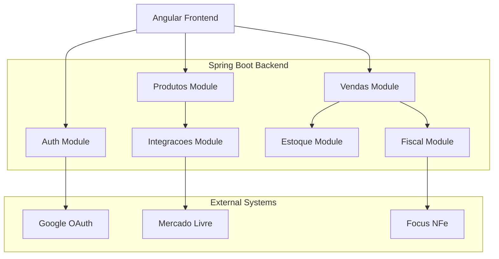

# 6. Components

## 6.1. Backend Components (Spring Modulith Modules)

```
com.estoquecentral/
├── auth/                    # Autenticação e autorização
├── produtos/                # Gestão de produtos e categorias
├── estoque/                 # Controle de estoque
├── vendas/                  # Vendas (PDV, B2B, B2C)
├── compras/                 # Compras e recebimento
├── fiscal/                  # Emissão de NFCe
└── integracoes/             # Mercado Livre, Focus NFe
```

## 6.2. Frontend Components (Angular Features)

```
src/app/
├── core/                    # Auth, HTTP interceptors
├── shared/                  # Componentes compartilhados
├── features/
│   ├── produtos/            # Listagem, form, detalhes
│   ├── pdv/                 # Ponto de Venda
│   ├── vendas/              # Histórico de vendas
│   ├── estoque/             # Movimentações
│   └── compras/             # Ordens de compra
└── layout/                  # Header, sidebar, main layout
```

## 6.3. Component Diagram


