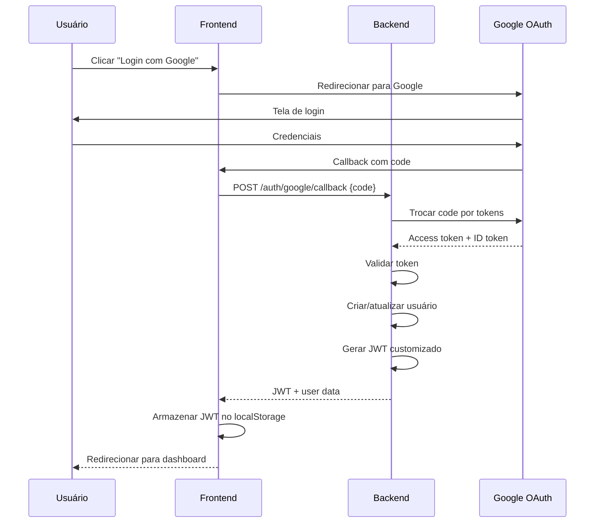
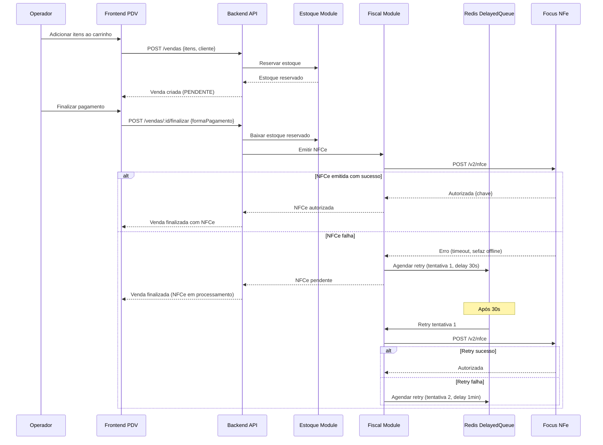
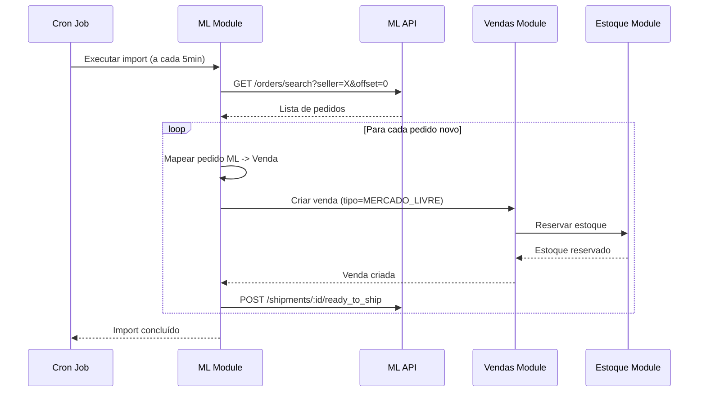
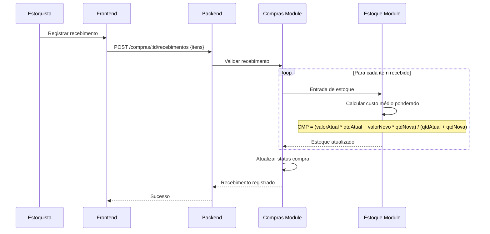
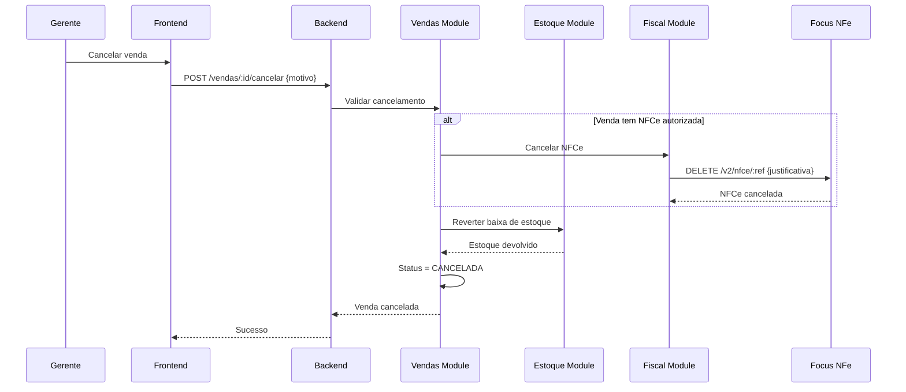

# 8. Core Workflows

## 8.1. Fluxo de Autenticação OAuth

## 8.2. Fluxo de Venda PDV com NFCe Retry

## 8.3. Fluxo de Importação de Pedido Mercado Livre

## 8.4. Fluxo de Recebimento de Compra

## 8.5. Fluxo de Cancelamento de Venda

