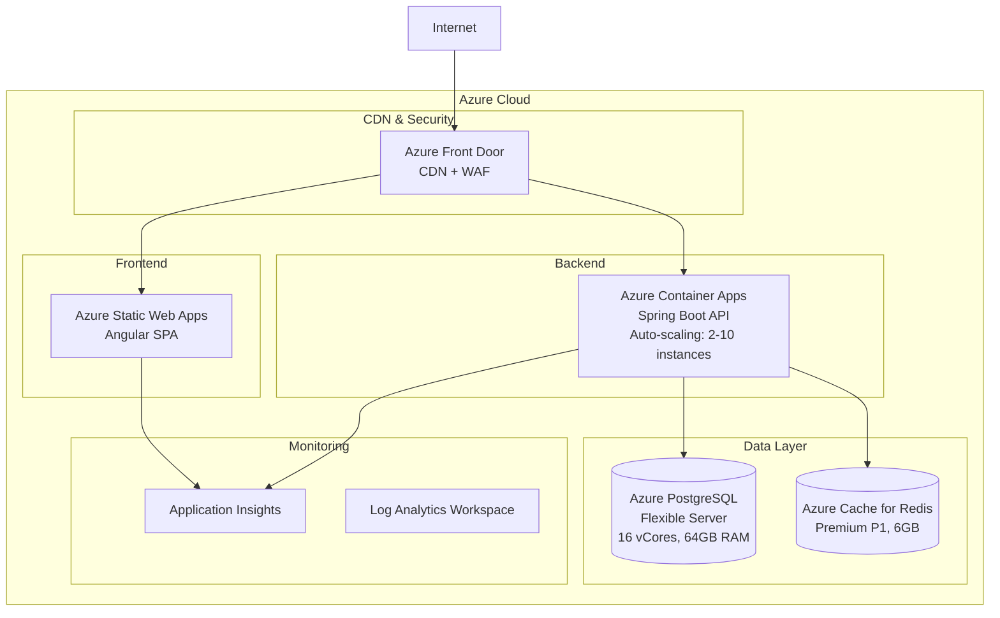
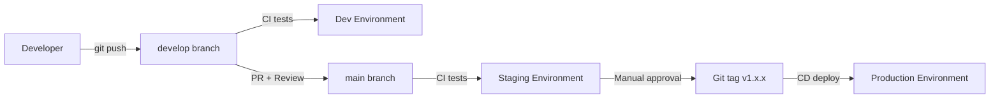

# 14. Deployment Architecture

## 14.1. Azure Infrastructure Overview



## 14.2. Azure Container Apps Configuration

### **Container App Settings**

```yaml
# Azure Container Apps Environment
environment:
  name: estoque-central-env
  location: Brazil South
  internal: false

# Backend Container App
containerApp:
  name: estoque-central-api
  image: ghcr.io/estoque-central/backend:latest
  resources:
    cpu: 1.0
    memory: 2Gi

  scale:
    minReplicas: 2
    maxReplicas: 10
    rules:
      - name: http-scaling
        http:
          concurrent: 50
      - name: cpu-scaling
        custom:
          type: cpu
          value: 70

  ingress:
    external: true
    targetPort: 8080
    transport: http
    allowInsecure: false
    customDomains:
      - name: api.estoquecentral.com
        certificateId: /certificates/api-cert

  secrets:
    - name: db-password
      keyVaultUrl: https://estoque-kv.vault.azure.net/secrets/db-password
    - name: jwt-secret
      keyVaultUrl: https://estoque-kv.vault.azure.net/secrets/jwt-secret

  env:
    - name: SPRING_PROFILES_ACTIVE
      value: prod
    - name: SPRING_DATASOURCE_URL
      value: jdbc:postgresql://estoque-central-db.postgres.database.azure.com:5432/estoque_central
    - name: SPRING_DATASOURCE_PASSWORD
      secretRef: db-password
    - name: APP_JWT_SECRET
      secretRef: jwt-secret
    - name: SPRING_DATA_REDIS_HOST
      value: estoque-central-redis.redis.cache.windows.net
```

### **Bicep Template (IaC)**

```bicep
// infrastructure/azure/main.bicep

param location string = 'brazilsouth'
param environment string = 'prod'

// Container Apps Environment
resource containerAppEnv 'Microsoft.App/managedEnvironments@2023-05-01' = {
  name: 'estoque-central-env-${environment}'
  location: location
  properties: {
    appLogsConfiguration: {
      destination: 'log-analytics'
      logAnalyticsConfiguration: {
        customerId: logAnalytics.properties.customerId
        sharedKey: logAnalytics.listKeys().primarySharedKey
      }
    }
  }
}

// Backend Container App
resource backendApp 'Microsoft.App/containerApps@2023-05-01' = {
  name: 'estoque-central-api-${environment}'
  location: location
  properties: {
    managedEnvironmentId: containerAppEnv.id
    configuration: {
      ingress: {
        external: true
        targetPort: 8080
        transport: 'http'
        allowInsecure: false
      }
      secrets: [
        {
          name: 'db-password'
          keyVaultUrl: 'https://estoque-kv.vault.azure.net/secrets/db-password'
          identity: userAssignedIdentity.id
        }
      ]
    }
    template: {
      containers: [
        {
          name: 'backend'
          image: 'ghcr.io/estoque-central/backend:latest'
          resources: {
            cpu: json('1.0')
            memory: '2Gi'
          }
          env: [
            {
              name: 'SPRING_PROFILES_ACTIVE'
              value: 'prod'
            }
            {
              name: 'SPRING_DATASOURCE_PASSWORD'
              secretRef: 'db-password'
            }
          ]
        }
      ]
      scale: {
        minReplicas: 2
        maxReplicas: 10
        rules: [
          {
            name: 'http-rule'
            http: {
              metadata: {
                concurrentRequests: '50'
              }
            }
          }
        ]
      }
    }
  }
}

// PostgreSQL Flexible Server
resource postgresServer 'Microsoft.DBforPostgreSQL/flexibleServers@2023-03-01-preview' = {
  name: 'estoque-central-db-${environment}'
  location: location
  sku: {
    name: 'Standard_D4s_v3'
    tier: 'GeneralPurpose'
  }
  properties: {
    version: '16'
    administratorLogin: 'pgadmin'
    administratorLoginPassword: dbPassword
    storage: {
      storageSizeGB: 128
      autoGrow: 'Enabled'
    }
    backup: {
      backupRetentionDays: 30
      geoRedundantBackup: 'Enabled'
    }
    highAvailability: {
      mode: 'ZoneRedundant'
    }
  }
}

// Azure Cache for Redis
resource redisCache 'Microsoft.Cache/redis@2023-08-01' = {
  name: 'estoque-central-redis-${environment}'
  location: location
  properties: {
    sku: {
      name: 'Premium'
      family: 'P'
      capacity: 1
    }
    enableNonSslPort: false
    minimumTlsVersion: '1.2'
    redisConfiguration: {
      'maxmemory-policy': 'allkeys-lru'
    }
  }
}

// Static Web App (Frontend)
resource staticWebApp 'Microsoft.Web/staticSites@2023-01-01' = {
  name: 'estoque-central-frontend-${environment}'
  location: location
  sku: {
    name: 'Standard'
    tier: 'Standard'
  }
  properties: {
    buildProperties: {
      appLocation: '/frontend'
      outputLocation: 'dist/estoque-central'
    }
  }
}
```

## 14.3. CI/CD Pipeline (GitHub Actions)

### **Backend CI/CD**

```yaml
# .github/workflows/backend-deploy.yml
name: Backend Deploy

on:
  push:
    branches: [main]
    paths:
      - 'backend/**'

env:
  REGISTRY: ghcr.io
  IMAGE_NAME: estoque-central/backend

jobs:
  build-and-deploy:
    runs-on: ubuntu-latest
    permissions:
      contents: read
      packages: write

    steps:
      - uses: actions/checkout@v4

      - name: Set up Java 21
        uses: actions/setup-java@v4
        with:
          java-version: '21'
          distribution: 'temurin'
          cache: 'maven'

      - name: Run tests
        run: |
          cd backend
          ./mvnw verify

      - name: Build JAR
        run: |
          cd backend
          ./mvnw clean package -DskipTests

      - name: Log in to Container Registry
        uses: docker/login-action@v3
        with:
          registry: ${{ env.REGISTRY }}
          username: ${{ github.actor }}
          password: ${{ secrets.GITHUB_TOKEN }}

      - name: Build and push Docker image
        uses: docker/build-push-action@v5
        with:
          context: .
          file: docker/backend.Dockerfile
          push: true
          tags: |
            ${{ env.REGISTRY }}/${{ env.IMAGE_NAME }}:latest
            ${{ env.REGISTRY }}/${{ env.IMAGE_NAME }}:${{ github.sha }}

      - name: Deploy to Azure Container Apps
        uses: azure/container-apps-deploy-action@v1
        with:
          appSourcePath: ${{ github.workspace }}
          acrName: estoquecentral
          containerAppName: estoque-central-api-prod
          resourceGroup: estoque-central-rg
          imageToDeploy: ${{ env.REGISTRY }}/${{ env.IMAGE_NAME }}:${{ github.sha }}
          azureCredentials: ${{ secrets.AZURE_CREDENTIALS }}
```

### **Frontend CI/CD**

```yaml
# .github/workflows/frontend-deploy.yml
name: Frontend Deploy

on:
  push:
    branches: [main]
    paths:
      - 'frontend/**'

jobs:
  build-and-deploy:
    runs-on: ubuntu-latest

    steps:
      - uses: actions/checkout@v4

      - name: Set up Node.js
        uses: actions/setup-node@v4
        with:
          node-version: '18'
          cache: 'npm'
          cache-dependency-path: frontend/package-lock.json

      - name: Install dependencies
        run: |
          cd frontend
          npm ci

      - name: Run tests
        run: |
          cd frontend
          npm test -- --watch=false --browsers=ChromeHeadless

      - name: Build
        run: |
          cd frontend
          npm run build -- --configuration production

      - name: Deploy to Azure Static Web Apps
        uses: Azure/static-web-apps-deploy@v1
        with:
          azure_static_web_apps_api_token: ${{ secrets.AZURE_STATIC_WEB_APPS_API_TOKEN }}
          repo_token: ${{ secrets.GITHUB_TOKEN }}
          action: 'upload'
          app_location: '/frontend'
          output_location: 'dist/estoque-central'
```

## 14.4. Environment Strategy

| Ambiente | Branch | Deploy | URL | Database |
|----------|--------|--------|-----|----------|
| **Development** | `develop` | Manual | dev.estoquecentral.app | Azure PostgreSQL (Basic tier) |
| **Staging** | `main` (auto) | Automático | staging.estoquecentral.app | Azure PostgreSQL (GP tier, clone prod) |
| **Production** | `main` (tag) | Manual approval | app.estoquecentral.com | Azure PostgreSQL (GP tier, HA) |

### **Deployment Flow**



## 14.5. Blue-Green Deployment

```yaml
# Azure Container Apps Revisions
revisions:
  - name: estoque-central-api--v1-0-0
    weight: 0  # Old version (green)

  - name: estoque-central-api--v1-1-0
    weight: 100  # New version (blue)

# Rollback rápido: ajustar weights
# Old: 100%, New: 0%
```

### **Rollback Strategy**

```bash
# Via Azure CLI
az containerapp revision set-mode \
  --name estoque-central-api \
  --resource-group estoque-central-rg \
  --mode multiple

# Ativar revision anterior
az containerapp ingress traffic set \
  --name estoque-central-api \
  --resource-group estoque-central-rg \
  --revision-weight estoque-central-api--v1-0-0=100 \
                    estoque-central-api--v1-1-0=0
```

## 14.6. Database Migration Strategy

### **Flyway em Produção**

```yaml
# application-prod.yml
spring:
  flyway:
    enabled: true
    baseline-on-migrate: true
    validate-on-migrate: true
    clean-disabled: true  # CRÍTICO: Nunca permitir clean em prod
```

### **Migration Checklist**

1. ✅ Testar migration em staging
2. ✅ Backup automático antes de migration
3. ✅ Executar migration em janela de manutenção
4. ✅ Verificar logs de migration
5. ✅ Smoke tests após deploy

### **Migration Automation**

```bash
# Script de deploy com migration
#!/bin/bash
set -e

echo "1. Backup database..."
az postgres flexible-server backup create \
  --resource-group estoque-central-rg \
  --name estoque-central-db-prod

echo "2. Deploy new container app revision..."
az containerapp update \
  --name estoque-central-api \
  --resource-group estoque-central-rg \
  --image ghcr.io/estoque-central/backend:$VERSION

echo "3. Flyway migrations run automatically on startup..."
echo "4. Monitoring health checks..."
sleep 30

az containerapp show \
  --name estoque-central-api \
  --resource-group estoque-central-rg \
  --query "properties.runningStatus"

echo "5. Deploy complete!"
```

## 14.7. Scaling Strategy

### **Horizontal Scaling (Auto)**

```yaml
scale:
  minReplicas: 2
  maxReplicas: 10
  rules:
    - name: http-concurrent
      http:
        concurrent: 50

    - name: cpu-usage
      custom:
        type: cpu
        value: 70  # 70% CPU

    - name: memory-usage
      custom:
        type: memory
        value: 80  # 80% Memory
```

### **Vertical Scaling (Manual)**

| Load | CPU | Memory | Replicas |
|------|-----|--------|----------|
| Baixo | 0.5 | 1Gi | 2 |
| Médio | 1.0 | 2Gi | 2-5 |
| Alto | 2.0 | 4Gi | 5-10 |

## 14.8. Cost Optimization

### **Estimated Monthly Costs (Brazil South)**

| Resource | Tier | Cost (USD/month) |
|----------|------|------------------|
| Container Apps (2-10 instances) | 1 vCPU, 2GB | $50-250 |
| PostgreSQL Flexible Server | GP 4 vCores, 128GB | $300 |
| Redis Premium P1 | 6GB | $200 |
| Static Web Apps | Standard | $10 |
| Application Insights | Pay-as-you-go | $50 |
| **Total Estimated** | | **$610-810/month** |

### **Cost Savings**

- ✅ Scale-to-zero em dev/staging fora do horário comercial
- ✅ Reserved instances para PostgreSQL (até 60% desconto)
- ✅ CDN caching reduz tráfego backend
- ✅ Connection pooling reduz conexões DB

## 14.9. Health Checks

### **Backend Health Endpoint**

```java
@RestController
@RequestMapping("/health")
class HealthController {
    private final DataSource dataSource;
    private final RedisConnectionFactory redis;

    @GetMapping
    ResponseEntity<HealthStatus> health() {
        boolean dbHealthy = checkDatabase();
        boolean redisHealthy = checkRedis();

        if (dbHealthy && redisHealthy) {
            return ResponseEntity.ok(new HealthStatus("UP"));
        }
        return ResponseEntity.status(503)
            .body(new HealthStatus("DOWN"));
    }

    private boolean checkDatabase() {
        try (var conn = dataSource.getConnection()) {
            return conn.isValid(5);
        } catch (Exception e) {
            return false;
        }
    }
}
```

### **Container Apps Health Probe**

```yaml
probes:
  liveness:
    httpGet:
      path: /health
      port: 8080
    initialDelaySeconds: 30
    periodSeconds: 10
    timeoutSeconds: 5
    failureThreshold: 3

  readiness:
    httpGet:
      path: /health/ready
      port: 8080
    initialDelaySeconds: 10
    periodSeconds: 5
```

## 14.10. Disaster Recovery

### **Backup Strategy**

- **PostgreSQL**: Automated backups (30 dias), PITR (Point-in-Time Restore)
- **Redis**: Persistence RDB + AOF
- **Container Images**: Versionadas no GitHub Container Registry

### **RTO/RPO**

- **RTO (Recovery Time Objective)**: 1 hora
- **RPO (Recovery Point Objective)**: 5 minutos

### **DR Plan**

1. Detectar falha (alertas Application Insights)
2. Rollback para revision anterior (< 5 min)
3. Se necessário: restore database backup
4. Validar serviços com smoke tests
5. Comunicar status aos usuários
