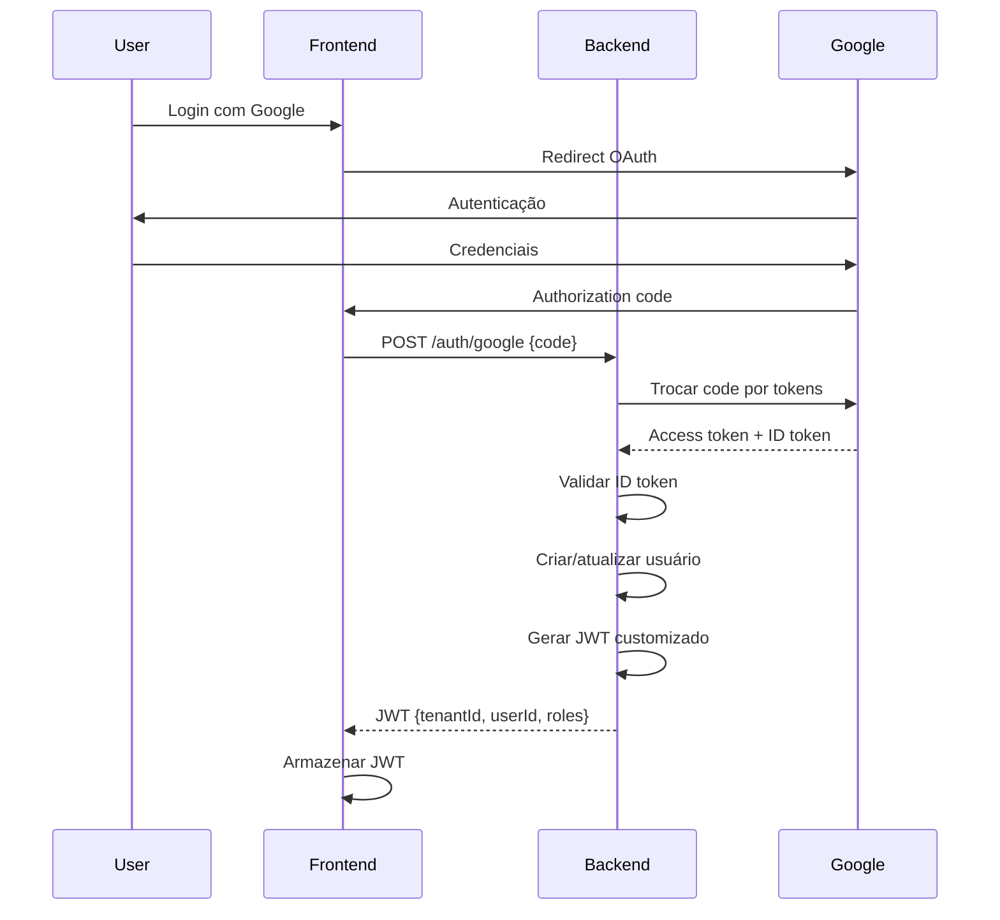

# 15. Security and Performance

## 15.1. Security Requirements

### **OWASP Top 10 Mitigations**

| Vulnerability | Mitigation | Implementation |
|---------------|-----------|----------------|
| **A01: Broken Access Control** | Role-based + tenant isolation | Spring Security + TenantFilter |
| **A02: Cryptographic Failures** | TLS 1.3, JWT signing | Azure Front Door + JJWT |
| **A03: Injection** | Prepared statements | Spring Data JDBC parameterized queries |
| **A04: Insecure Design** | Threat modeling | Multi-tenant schema isolation |
| **A05: Security Misconfiguration** | Hardened configs | Azure Security Center recommendations |
| **A06: Vulnerable Components** | Dependency scanning | Dependabot + Snyk |
| **A07: Auth Failures** | OAuth 2.0 + MFA | Google OAuth + rate limiting |
| **A08: Software/Data Integrity** | Signed images | GitHub Container Registry signed images |
| **A09: Logging Failures** | Centralized logging | Application Insights + audit trail |
| **A10: SSRF** | Allowlist external APIs | Firewall rules + network policies |

---

## 15.2. Authentication & Authorization

### **OAuth 2.0 Flow**



### **JWT Structure**

```json
{
  "header": {
    "alg": "HS256",
    "typ": "JWT"
  },
  "payload": {
    "sub": "user-uuid",
    "tenantId": "tenant-uuid",
    "email": "user@example.com",
    "roles": ["ADMIN", "GERENTE"],
    "iat": 1699900000,
    "exp": 1699986400
  }
}
```

### **Spring Security Configuration**

```java
@Configuration
@EnableWebSecurity
@EnableMethodSecurity
class SecurityConfig {
    @Bean
    SecurityFilterChain filterChain(HttpSecurity http) throws Exception {
        return http
            .csrf(csrf -> csrf.disable())
            .cors(cors -> cors.configurationSource(corsConfigurationSource()))
            .authorizeHttpRequests(auth -> auth
                .requestMatchers("/api/auth/**").permitAll()
                .requestMatchers("/api/webhooks/**").permitAll()
                .requestMatchers("/health/**").permitAll()
                .requestMatchers("/api/admin/**").hasRole("ADMIN")
                .requestMatchers("/api/**").authenticated()
            )
            .oauth2Login(oauth2 -> oauth2
                .userInfoEndpoint(userInfo -> userInfo
                    .userService(customOAuth2UserService)
                )
            )
            .addFilterBefore(jwtAuthFilter, UsernamePasswordAuthenticationFilter.class)
            .addFilterBefore(tenantFilter, JwtAuthFilter.class)
            .sessionManagement(session -> session
                .sessionCreationPolicy(SessionCreationPolicy.STATELESS)
            )
            .build();
    }

    @Bean
    PasswordEncoder passwordEncoder() {
        return new BCryptPasswordEncoder(12);
    }
}
```

### **Role-Based Access Control**

```java
// Controller com autorização
@RestController
@RequestMapping("/api/produtos")
class ProdutoController {
    @GetMapping
    @PreAuthorize("hasAnyRole('ADMIN', 'GERENTE', 'OPERADOR_PDV')")
    ResponseEntity<List<Produto>> listar() {
        // Qualquer um pode listar
    }

    @PostMapping
    @PreAuthorize("hasAnyRole('ADMIN', 'GERENTE')")
    ResponseEntity<Produto> criar(@RequestBody ProdutoRequest request) {
        // Apenas admin e gerente podem criar
    }

    @DeleteMapping("/{id}")
    @PreAuthorize("hasRole('ADMIN')")
    ResponseEntity<Void> deletar(@PathVariable UUID id) {
        // Apenas admin pode deletar
    }
}
```

---

## 15.3. Data Security

### **Encryption at Rest**

- **PostgreSQL**: Azure Disk Encryption (AES-256)
- **Redis**: Encryption at rest habilitado
- **Secrets**: Azure Key Vault com HSM

### **Encryption in Transit**

- **TLS 1.3** obrigatório para todas as conexões
- **HTTPS only** via Azure Front Door
- **PostgreSQL SSL mode**: `require`

```yaml
# application-prod.yml
spring:
  datasource:
    url: jdbc:postgresql://db.postgres.database.azure.com:5432/estoque_central?sslmode=require
```

### **Sensitive Data Handling**

```java
// Value Object para dados sensíveis
public record CPF(String valor) {
    public CPF {
        if (!isValid(valor)) {
            throw new IllegalArgumentException("CPF inválido");
        }
    }

    // Não expor CPF completo em logs
    @Override
    public String toString() {
        return "CPF[***" + valor.substring(valor.length() - 2) + "]";
    }

    public String masked() {
        return "***.***." + valor.substring(valor.length() - 3);
    }
}
```

### **PII Data Masking**

```java
// Mascarar dados pessoais em logs
@Slf4j
class AuditLogger {
    void logUserAction(Usuario usuario, String action) {
        log.info("User action: userId={}, email={}, action={}",
            usuario.getId(),
            maskEmail(usuario.getEmail()),
            action
        );
    }

    private String maskEmail(String email) {
        var parts = email.split("@");
        return parts[0].charAt(0) + "***@" + parts[1];
    }
}
```

---

## 15.4. Multi-Tenant Security

### **Tenant Isolation Enforcement**

```java
@Aspect
@Component
class TenantSecurityAspect {
    @Before("@annotation(RequiresTenant)")
    public void checkTenant(JoinPoint joinPoint) {
        UUID tenantId = TenantContext.getTenant();
        if (tenantId == null) {
            throw new SecurityException("Tenant context not set");
        }
    }

    // Verificar que entidade pertence ao tenant
    @Around("execution(* com.estoquecentral..*.findById(..))")
    public Object verifyTenantOwnership(ProceedingJoinPoint pjp) throws Throwable {
        Object result = pjp.proceed();
        if (result instanceof TenantScoped entity) {
            UUID currentTenant = TenantContext.getTenant();
            if (!entity.getTenantId().equals(currentTenant)) {
                throw new AccessDeniedException("Resource not found");
            }
        }
        return result;
    }
}
```

### **Row-Level Security (Defense in Depth)**

```sql
-- Adicionar tenant_id check em todas as queries
-- Via repository layer enforcement
SELECT * FROM produtos WHERE id = ? AND tenant_id = ?
```

---

## 15.5. Input Validation

### **Bean Validation**

```java
// Request DTO com validações
public record CriarProdutoRequest(
    @NotBlank(message = "Nome é obrigatório")
    @Size(max = 255)
    String nome,

    @NotBlank
    @Pattern(regexp = "^[A-Z0-9-]+$")
    String sku,

    @NotNull
    @Positive
    BigDecimal preco,

    @Email
    String email,

    @Valid
    List<@Valid VarianteAtributoRequest> atributos
) {}
```

### **Custom Validators**

```java
@Constraint(validatedBy = CNPJValidator.class)
@Target({ElementType.FIELD, ElementType.PARAMETER})
@Retention(RetentionPolicy.RUNTIME)
public @interface ValidCNPJ {
    String message() default "CNPJ inválido";
    Class<?>[] groups() default {};
    Class<? extends Payload>[] payload() default {};
}

class CNPJValidator implements ConstraintValidator<ValidCNPJ, String> {
    @Override
    public boolean isValid(String cnpj, ConstraintValidatorContext context) {
        if (cnpj == null) return true;
        return CNPJUtils.validate(cnpj);
    }
}
```

---

## 15.6. Rate Limiting

### **API Rate Limits**

```java
@Component
class RateLimitInterceptor implements HandlerInterceptor {
    private final RedisTemplate<String, Integer> redis;

    @Override
    public boolean preHandle(HttpServletRequest request, ...) {
        String userId = extractUserId(request);
        String key = "rate_limit:" + userId;

        Integer requests = redis.opsForValue().get(key);
        if (requests == null) {
            redis.opsForValue().set(key, 1, 1, TimeUnit.MINUTES);
            return true;
        }

        if (requests >= 100) { // 100 req/min
            throw new RateLimitExceededException();
        }

        redis.opsForValue().increment(key);
        return true;
    }
}
```

### **Rate Limits por Endpoint**

| Endpoint | Limit | Window |
|----------|-------|--------|
| `POST /auth/login` | 5 req | 1 min |
| `GET /produtos` | 100 req | 1 min |
| `POST /vendas` | 50 req | 1 min |
| `POST /integracoes/ml/*` | 10 req | 10 sec |

---

## 15.7. Performance Optimization

### **Database Performance**

#### **Indexes Strategy**

```sql
-- Índices críticos para performance
CREATE INDEX idx_produtos_sku ON produtos(sku);
CREATE INDEX idx_produtos_categoria ON produtos(categoria_id);
CREATE INDEX idx_vendas_data ON vendas(created_at DESC);
CREATE INDEX idx_vendas_status ON vendas(status) WHERE status != 'CANCELADA';
CREATE INDEX idx_itens_venda_produto ON itens_venda(produto_id);

-- Índice para full-text search
CREATE INDEX idx_produtos_search ON produtos USING GIN(to_tsvector('portuguese', nome || ' ' || COALESCE(descricao, '')));
```

#### **Query Optimization**

```java
// RUIM: N+1 queries
List<Venda> vendas = vendaRepository.findAll();
vendas.forEach(v -> {
    v.getItens().forEach(item -> {
        item.getProduto(); // Query adicional!
    });
});

// BOM: Fetch com JOIN
@Query("""
    SELECT v FROM Venda v
    LEFT JOIN FETCH v.itens i
    LEFT JOIN FETCH i.produto
    WHERE v.status = :status
""")
List<Venda> findAllWithItens(StatusVenda status);
```

#### **Connection Pooling**

```yaml
# application-prod.yml
spring:
  datasource:
    hikari:
      maximum-pool-size: 20
      minimum-idle: 5
      connection-timeout: 30000
      idle-timeout: 600000
      max-lifetime: 1800000
```

### **Caching Strategy**

#### **Redis Caching**

```java
@Service
class ProdutoService {
    @Cacheable(value = "produtos", key = "#id")
    Optional<Produto> buscar(ProdutoId id) {
        return repository.findById(id);
    }

    @CacheEvict(value = "produtos", key = "#produto.id")
    void atualizar(Produto produto) {
        repository.save(produto);
    }

    @Cacheable(value = "produtos:list", key = "#tenantId")
    List<Produto> listar(UUID tenantId) {
        return repository.findAllByTenant(tenantId);
    }
}
```

#### **Cache Configuration**

```yaml
spring:
  cache:
    type: redis
    redis:
      time-to-live: 600000 # 10 minutes
      cache-null-values: false
```

#### **Cache Hierarchy**

```
Browser Cache (10min)
  ↓
CDN Cache (1h) - Static assets
  ↓
Redis Cache (10min) - API responses
  ↓
Database
```

### **Frontend Performance**

#### **Lazy Loading**

```typescript
// Lazy load routes
export const routes: Routes = [
  {
    path: 'produtos',
    loadComponent: () =>
      import('./features/produtos/produto-list/produto-list.component')
  },
  {
    path: 'vendas',
    loadChildren: () =>
      import('./features/vendas/vendas.routes')
  }
];
```

#### **Virtual Scrolling**

```typescript
// Para listas grandes (1000+ itens)
@Component({
  template: `
    <cdk-virtual-scroll-viewport itemSize="50" class="viewport">
      <div *cdkVirtualFor="let produto of produtos" class="item">
        {{ produto.nome }}
      </div>
    </cdk-virtual-scroll-viewport>
  `
})
export class ProdutoListComponent {
  produtos = signal<Produto[]>([]);
}
```

#### **Image Optimization**

- WebP format para imagens
- Lazy loading com `loading="lazy"`
- CDN para static assets

### **API Performance Targets**

| Métrica | Target | Measurement |
|---------|--------|-------------|
| **Response Time (p50)** | < 100ms | Application Insights |
| **Response Time (p95)** | < 200ms | Application Insights |
| **Response Time (p99)** | < 500ms | Application Insights |
| **Throughput** | 500+ req/s | Load testing |
| **Error Rate** | < 0.1% | Application Insights |
| **Uptime** | 99.5% | Azure Monitor |

---

## 15.8. Security Scanning

### **Dependency Scanning**

```yaml
# .github/workflows/security-scan.yml
name: Security Scan

on:
  schedule:
    - cron: '0 0 * * 1'  # Weekly
  pull_request:

jobs:
  scan:
    runs-on: ubuntu-latest
    steps:
      - uses: actions/checkout@v4

      - name: Run Snyk
        uses: snyk/actions/maven@master
        env:
          SNYK_TOKEN: ${{ secrets.SNYK_TOKEN }}

      - name: Run Trivy
        uses: aquasecurity/trivy-action@master
        with:
          scan-type: 'fs'
          scan-ref: '.'
          format: 'sarif'
          output: 'trivy-results.sarif'
```

### **SAST (Static Application Security Testing)**

```yaml
# SonarQube integration
sonar:
  projectKey: estoque-central
  organization: estoque-central
  host:
    url: https://sonarcloud.io
```

### **DAST (Dynamic Application Security Testing)**

- OWASP ZAP scan em staging antes de produção
- Testes de penetração trimestrais

---

## 15.9. Audit Trail

### **Audit Log Model**

```java
@Entity
@Table(name = "audit_log")
class AuditLog {
    @Id
    UUID id;

    UUID tenantId;
    UUID userId;
    String action; // CREATE, UPDATE, DELETE
    String entityType; // Produto, Venda, etc
    UUID entityId;
    String changes; // JSON diff
    Instant timestamp;
    String ipAddress;
}
```

### **Audit Interceptor**

```java
@Aspect
@Component
class AuditAspect {
    @AfterReturning(
        pointcut = "@annotation(Audited)",
        returning = "result"
    )
    public void audit(JoinPoint joinPoint, Object result) {
        var userId = SecurityContextHolder.getContext()
            .getAuthentication()
            .getName();

        auditLogRepository.save(new AuditLog(
            TenantContext.getTenant(),
            UUID.fromString(userId),
            joinPoint.getSignature().getName(),
            extractEntityType(result),
            extractEntityId(result),
            Instant.now()
        ));
    }
}
```

---

## 15.10. Security Checklist

**Deployment Checklist:**

- [ ] Secrets em Azure Key Vault (não hardcoded)
- [ ] TLS 1.3 habilitado
- [ ] CORS configurado corretamente
- [ ] Rate limiting ativo
- [ ] WAF rules ativas (Azure Front Door)
- [ ] Dependency scan passou
- [ ] Penetration test realizado
- [ ] Audit logging funcionando
- [ ] Backup strategy testada
- [ ] Disaster recovery plan documentado
